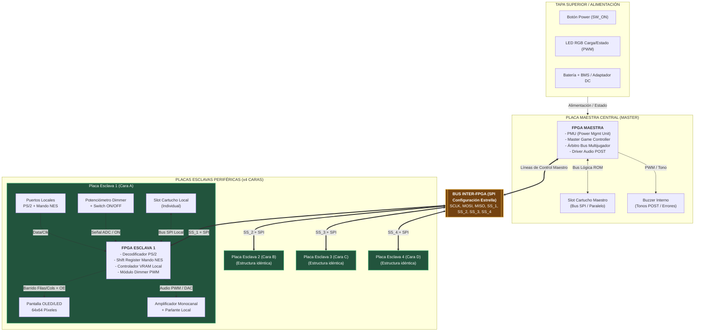

```mermaid
graph TD
    %% Estilos de Nodos
    classDef topStyle fill:#2d3748,stroke:#4a5568,stroke-width:2px,color:#fff;
    classDef masterStyle fill:#1a365d,stroke:#2b6cb0,stroke-width:2px,color:#fff;
    classDef slaveStyle fill:#22543d,stroke:#38a169,stroke-width:2px,color:#fff;
    classDef busStyle fill:#744210,stroke:#d69e2e,stroke-width:2px,color:#fff;

    %% 1. TAPA SUPERIOR / ALIMENTACIÓN
    subgraph TOP["TAPA SUPERIOR / ALIMENTACIÓN"]
        PWR_BTN["Botón Power (SW_ON)"]
        LED_RGB["LED RGB Carga/Estado (PWM)"]
        BATT_DC["Batería + BMS / Adaptador DC"]
    end
    class TOP topStyle;

    %% 2. PLACA MAESTRA CENTRAL
    subgraph MASTER_BOARD["PLACA MAESTRA CENTRAL (MASTER)"]
        FPGA_M["<b>FPGA MAESTRA</b><br/>- PMU (Power Mgmt Unit)<br/>- Master Game Controller<br/>- Árbitro Bus Multijugador<br/>- Driver Audio POST"]
        CART_M["Slot Cartucho Maestro<br/>(Bus SPI / Paralelo)"]
        BUZZER["Buzzer Interno<br/>(Tonos POST / Errores)"]

        FPGA_M <-->|"Bus Lógica ROM"| CART_M
        FPGA_M -->|"PWM / Tono"| BUZZER
    end
    class MASTER_BOARD masterStyle;

    TOP -->|"Alimentación / Estado"| MASTER_BOARD

    %% 3. BUS INTER-FPGA
    BUS[["<b>BUS INTER-FPGA (SPI Configuración Estrella)</b><br/>SCLK, MOSI, MISO, SS_1, SS_2, SS_3, SS_4"]]
    class BUS busStyle;

    FPGA_M <==>|"Líneas de Control Maestro"| BUS

    %% 4. PLACAS ESCLAVAS (X4 CARAS)
    subgraph SLAVES["PLACAS ESCLAVAS PERIFÉRICAS (x4 CARAS)"]
        
        %% CARA A (Estructura detallada)
        subgraph SLAVE_A["Placa Esclava 1 (Cara A)"]
            FPGA_S1["<b>FPGA ESCLAVA 1</b><br/>- Decodificador PS/2<br/>- Shift Register Mando NES<br/>- Controlador VRAM Local<br/>- Módulo Dimmer PWM"]
            DISP_1["Pantalla OLED/LED<br/>64x64 Píxeles"]
            IO_1["Puertos Locales<br/>PS/2 + Mando NES"]
            POT_1["Potenciómetro Dimmer<br/>+ Switch ON/OFF"]
            AUDIO_1["Amplificador Monocanal<br/>+ Parlante Local"]
            CART_L1["Slot Cartucho Local<br/>(Individual)"]

            FPGA_S1 -->|"Barrido Filas/Cols + OE"| DISP_1
            IO_1 -->|"Data/Clk"| FPGA_S1
            POT_1 -->|"Señal ADC / ON"| FPGA_S1
            FPGA_S1 -->|"Audio PWM / DAC"| AUDIO_1
            CART_L1 <-->|"Bus SPI Local"| FPGA_S1
        end

        %% OTRAS CARAS (Representadas como bloques equivalentes)
        SLAVE_B["Placa Esclava 2 (Cara B)<br/>(Estructura idéntica)"]
        SLAVE_C["Placa Esclava 3 (Cara C)<br/>(Estructura idéntica)"]
        SLAVE_D["Placa Esclava 4 (Cara D)<br/>(Estructura idéntica)"]

    end
    class SLAVE_A,SLAVE_B,SLAVE_C,SLAVE_D slaveStyle;

    %% Conexiones del Bus a cada Esclava
    BUS <==>|"SS_1 + SPI"| FPGA_S1
    BUS <==>|"SS_2 + SPI"| SLAVE_B
    BUS <==>|"SS_3 + SPI"| SLAVE_C
    BUS <==>|"SS_4 + SPI"| SLAVE_D
```
