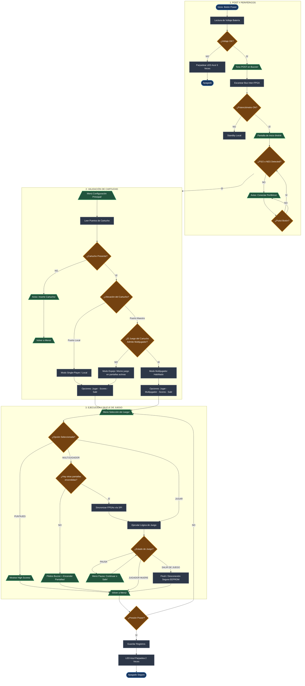

```mermaid
flowchart TD
    %% Estilos
    classDef terminalStyle fill:#1a365d,stroke:#2b6cb0,stroke-width:2px,color:#fff;
    classDef processStyle fill:#2d3748,stroke:#4a5568,stroke-width:2px,color:#fff;
    classDef decisionStyle fill:#744210,stroke:#d69e2e,stroke-width:2px,color:#fff;
    classDef ioStyle fill:#22543d,stroke:#38a169,stroke-width:2px,color:#fff;

    %% FASE 1: POST Y ENTRADAS
    subgraph F1["1. POST Y PERIFÉRICOS"]
        START([Inicio: Botón Power]):::terminalStyle --> READ_BAT[Lectura de Voltaje Batería]:::processStyle
        READ_BAT --> DEC_BAT{¿Voltaje OK?}:::decisionStyle
        
        DEC_BAT -- NO --> ERR_BAT[Parpadear LED Azul 3 Veces]:::processStyle --> OFF1([Apagado]):::terminalStyle
        DEC_BAT -- SÍ --> BEEP_POST[/Tono POST en Buzzer/\]:::ioStyle --> SCAN_BUS[Escanear Bus Inter-FPGA]:::processStyle
        
        SCAN_BUS --> POLL_POT{¿Potenciómetro ON?}:::decisionStyle
        POLL_POT -- NO --> STANDBY[Standby Local]:::processStyle
        POLL_POT -- SÍ --> BOOT_SCR[/Pantalla de Inicio 64x64/\]:::ioStyle --> CHECK_PERIPH{¿PS/2 o NES Detected?}:::decisionStyle
        
        CHECK_PERIPH -- NO --> WARN_P[/Aviso: Conectar Periférico/\]:::ioStyle
        WARN_P --> WAIT_P{¿Pulsó Botón?}:::decisionStyle
        WAIT_P -- SÍ --> CHECK_PERIPH
        WAIT_P -- NO --> WARN_P
    end

    CHECK_PERIPH -- SÍ --> F2

    %% FASE 2: VERIFICACIÓN DE CARTUCHO Y MODO DE JUEGO
    subgraph F2["2. VALIDACIÓN DE CARTUCHO"]
        MENU_CONF[/Menú Configuración Principal/\]:::ioStyle --> READ_CART[Leer Puertos de Cartucho]:::processStyle
        READ_CART --> DEC_CART{¿Cartucho Presente?}:::decisionStyle
        
        DEC_CART -- NO --> WARN_C[/Aviso: Inserte Cartucho/\]:::ioStyle --> RET1[/Volver a Menú/\]:::ioStyle
        
        DEC_CART -- SÍ --> DEC_PORT{¿Ubicación del Cartucho?}:::decisionStyle
        
        %% Cartucho Local
        DEC_PORT -- Puerto Local --> EN_SINGLE[Modo Single-Player / Local]:::processStyle --> SET_OPT1[Opciones: Jugar - Scores - Salir]:::processStyle
        
        %% Cartucho Maestro
        DEC_PORT -- Puerto Maestro --> DEC_MULTI_CAP{¿El Juego del Cartucho<br/>Admite Multijugador?}:::decisionStyle
        
        DEC_MULTI_CAP -- NO --> EN_MIRROR[Modo Espejo: Mismo juego en pantallas activas]:::processStyle --> SET_OPT1
        DEC_MULTI_CAP -- SÍ --> EN_MULTI[Modo Multijugador Habilitado]:::processStyle --> SET_OPT2[Opciones: Jugar - Multijugador - Scores - Salir]:::processStyle
    end

    SET_OPT1 --> GAME_MENU[/Menú Selección del Juego/\]:::ioStyle
    SET_OPT2 --> GAME_MENU

    %% FASE 3: BUCLE DE JUEGO
    subgraph F3["3. EJECUCIÓN Y BUCLE DE JUEGO"]
        GAME_MENU --> DEC_OPT{¿Opción Seleccionada?}:::decisionStyle
        
        %% Puntajes
        DEC_OPT -- PUNTAJES --> SHOW_SCORES[/Mostrar High Scores/\]:::ioStyle --> RET2[/Volver a Menú/\]:::ioStyle
        
        %% Multijugador
        DEC_OPT -- MULTIJUGADOR --> CHECK_SLAVES{¿Hay otras pantallas<br/>encendidas?}:::decisionStyle
        CHECK_SLAVES -- NO --> BEEP_MULTI[/Pitidos Buzzer + Encender Pantallas/\]:::ioStyle --> RET2
        CHECK_SLAVES -- SÍ --> SYNC_MULTI[Sincronizar FPGAs vía SPI]:::processStyle --> RUN_GAME
        
        %% Jugar
        DEC_OPT -- JUGAR --> RUN_GAME[Ejecutar Lógica de Juego]:::processStyle
        
        RUN_GAME --> GAME_STATE{¿Estado de Juego?}:::decisionStyle
        GAME_STATE -- PAUSA --> MENU_PAUSE[/Menú Pausa: Continuar o Salir/\]:::ioStyle --> GAME_STATE
        GAME_STATE -- JUGADOR MUERE --> RET2
        GAME_STATE -- SALIR DE JUEGO --> SAFE_UNMOUNT[Flush / Desconexión Segura EEPROM]:::processStyle --> RET2
    end

    %% FASE 4: APAGADO
    RET2 --> EVENT_OFF{¿Presión Power?}:::decisionStyle
    EVENT_OFF -- NO --> GAME_MENU
    EVENT_OFF -- SÍ --> SAVE_SYS[Guardar Registros]:::processStyle --> LED_OFF[LED Azul Parpadea 2 Veces]:::processStyle --> SHUTDOWN([Apagado Seguro]):::terminalStyle
```
