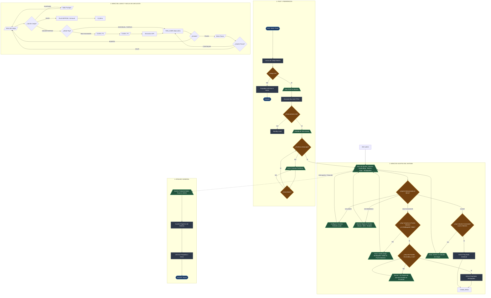

```mermaid
flowchart TD
    %% Estilos de Nodos
    classDef terminalStyle fill:#1a365d,stroke:#2b6cb0,stroke-width:2px,color:#fff;
    classDef processStyle fill:#2d3748,stroke:#4a5568,stroke-width:2px,color:#fff;
    classDef decisionStyle fill:#744210,stroke:#d69e2e,stroke-width:2px,color:#fff;
    classDef ioStyle fill:#22543d,stroke:#38a169,stroke-width:2px,color:#fff;

    %% FASE 1: POST Y PERIFÉRICOS
    subgraph F1["1. POST Y PERIFÉRICOS"]
        START([Inicio: Botón Power]):::terminalStyle --> READ_BAT[Lectura de Voltaje Batería]:::processStyle
        READ_BAT --> DEC_BAT{¿Voltaje OK?}:::decisionStyle
        
        DEC_BAT -- NO --> ERR_BAT[Parpadear LED Azul 3 Veces]:::processStyle --> OFF1([Apagado]):::terminalStyle
        DEC_BAT -- SÍ --> BEEP_POST[/Tono POST en Buzzer/\]:::ioStyle --> SCAN_BUS[Escanear Bus Inter-FPGA]:::processStyle
        
        SCAN_BUS --> POLL_POT{¿Potenciómetro ON?}:::decisionStyle
        POLL_POT -- NO --> STANDBY[Standby Local]:::processStyle
        POLL_POT -- SÍ --> BOOT_SCR[/Pantalla de Inicio 64x64/\]:::ioStyle --> CHECK_PERIPH{¿Periférico Detectado?}:::decisionStyle
        
        CHECK_PERIPH -- NO --> WARN_P[/Aviso: Conectar Periférico/\]:::ioStyle
        WARN_P --> WAIT_P{¿Pulsó Botón?}:::decisionStyle
        WAIT_P -- SÍ --> CHECK_PERIPH
        WAIT_P -- NO --> WARN_P
    end

    CHECK_PERIPH -- SÍ --> BIOS_MENU

    %% FASE 2: MENÚ DE AJUSTES DEL SISTEMA (BIOS / INICIO)
    subgraph F2["2. MENÚ DE AJUSTES DEL SISTEMA"]
        BIOS_MENU[/Menú de Ajustes: Volumen - Keybindings - Batería - Jugar - Multijugador/\]:::ioStyle
        
        BIOS_MENU --> DEC_BIOS{¿Opción Seleccionada en Menú?}:::decisionStyle
        
        %% Ajustes secundarios
        DEC_BIOS -- VOLUMEN --> CONF_VOL[/Configurar Volumen Parlante Local/\]:::ioStyle --> BIOS_MENU
        DEC_BIOS -- KEYBINDINGS --> SHOW_KEYS[/Mostrar Mapeo de Teclas: Mouse - NES - Teclado/\]:::ioStyle --> BIOS_MENU
        
        %% Opción MULTIJUGADOR
        DEC_BIOS -- MULTIJUGADOR --> CHK_M_CART{¿Hay Cartucho en Puerto Maestro<br/>y es Multijugador Válido?}:::decisionStyle
        CHK_M_CART -- NO --> WARN_NO_MULTI[/Aviso: Inserte Juego Multijugador Válido en Puerto Maestro/\]:::ioStyle --> BIOS_MENU
        CHK_M_CART -- SÍ --> WAIT_SLAVES{¿Hay otra Pantalla Encendida y Lista?}:::decisionStyle
        WAIT_SLAVES -- NO --> WARN_WAIT_SCR[/Buzzer + En Espera de que otra Pantalla se Encienda/\]:::ioStyle --> WAIT_SLAVES
        WAIT_SLAVES -- SÍ --> SET_MULTI_FLAG[Activar Flag Modo Multijugador]:::processStyle --> GAME_MENU
        
        %% Opción JUGAR (Individual / Espejo)
        DEC_BIOS -- JUGAR --> CHK_ANY_CART{¿Hay Cartucho Conectado?<br/>Local o Maestro}:::decisionStyle
        CHK_ANY_CART -- NO --> WARN_NO_CART[/Aviso: Inserte un Cartucho de Juego/\]:::ioStyle --> BIOS_MENU
        CHK_ANY_CART -- SÍ --> SET_SINGLE_FLAG[Activar Flag Modo Individual]:::processStyle --> GAME_MENU
    end

    %% FASE 3: BUCLE DE JUEGO Y PAUSA DETALLADO
    subgraph F3["3. MENÚ DEL JUEGO Y BUCLE DE EJECUCIÓN"]
        G_Menu[/"Menú del Juego"/]:::io --> G_Opt{"¿Opción Juego?"}:::decision

        %% Puntajes
        G_Opt -- PUNTAJES --> G_Pts[/"Tabla Puntajes"/]:::io --> G_Menu

        %% Salir del juego a BIOS
        G_Opt -- SALIR --> G_Flush["Flush EEPROM / Unmount"]:::process --> B_Menu

        %% Iniciar Partida
        G_Opt -- INICIAR PARTIDA --> G_Flag{"¿Modo Flag?"}:::decision
        G_Flag -- INDIVIDUAL / ESPEJO --> G_Run["RUN_GAME (Ejecución)"]:::process

        G_Flag -- MULTIJUGADOR --> G_ConfP1[/"Confirm. P1"/]:::io
        G_ConfP1 --> G_ConfP2[/"Confirm. P2"/]:::io
        G_ConfP2 --> G_SPI["Sincronizar SPI"]:::process
        G_SPI --> G_Run

        %% Evaluación de Estado durante RUN_GAME
        G_Run --> G_State{"¿Estado?"}:::decision
        
        %% Salida por Muerte
        G_State -- MUERTE --> G_Menu
        
        %% Salida por Menú de Pausa
        G_State -- PAUSA --> G_PauseMenu[/"Menú Pausa"/]:::io
        G_PauseMenu --> G_PauseOpt{"¿Opción Pausa?"}:::decision
        
        G_PauseOpt -- CONTINUAR --> G_Run
        G_PauseOpt -- SALIR --> G_Menu
    end

    RET_BIOS --> BIOS_MENU

    %% FASE 4: APAGADO (EVENTO DE HARDWARE)
    subgraph F4["4. APAGADO GENERAL"]
        EVENT_PWR[/Evento: Pulsación Botón Power en BIOS/\]:::ioStyle --> SAVE_SYS[Guardar Registros del Sistema]:::processStyle
        SAVE_SYS --> LED_OFF[LED Azul Parpadea 2 Veces]:::processStyle
        LED_OFF --> SHUTDOWN([Apagado Seguro]):::terminalStyle
    end

    BIOS_MENU -. Interrupción / Pulsación .-> EVENT_PWR
```
