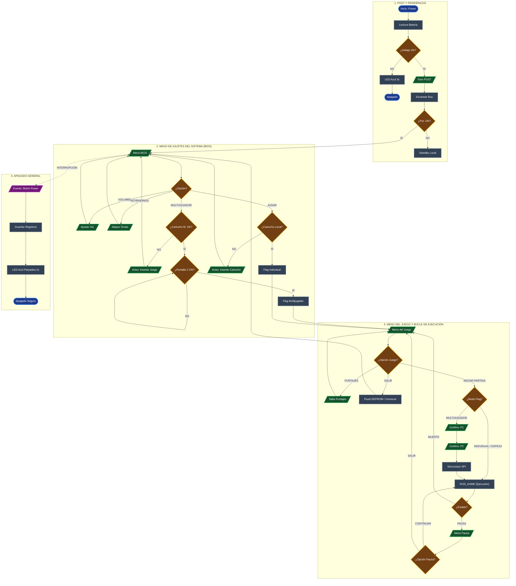

```mermaid
graph TD
    %% Estilos de Nodos
    classDef terminal fill:#1e3a8a,stroke:#3b82f6,stroke-width:2px,color:#fff;
    classDef process fill:#334155,stroke:#64748b,stroke-width:2px,color:#fff;
    classDef decision fill:#713f12,stroke:#eab308,stroke-width:2px,color:#fff;
    classDef io fill:#14532d,stroke:#22c55e,stroke-width:2px,color:#fff;
    classDef event fill:#701a75,stroke:#d946ef,stroke-width:2px,color:#fff;

    %% FASE 1: POST Y PERIFÉRICOS
    subgraph F1["1. POST Y PERIFÉRICOS"]
        P_Start(["Inicio: Power"]):::terminal --> P_Bat["Lectura Batería"]:::process
        P_Bat --> P_DecBat{"¿Voltaje OK?"}:::decision
        P_DecBat -- NO --> P_LedAzul["LED Azul 3x"]:::process --> P_Off(["Apagado"]):::terminal
        P_DecBat -- SÍ --> P_Tone[/"Tono POST"/]:::io --> P_Scan["Escanear Bus"]:::process
        P_Scan --> P_DecPot{"¿Pot. ON?"}:::decision
        P_DecPot -- NO --> P_Standby["Standby Local"]:::process
    end

    %% FASE 2: BIOS
    subgraph F2["2. MENÚ DE AJUSTES DEL SISTEMA (BIOS)"]
        B_Menu[/"Menú BIOS"/]:::io --> B_Opt{"¿Opción?"}:::decision
        
        %% Opción Volumen
        B_Opt -- VOLUMEN --> B_Vol[/"Ajustar Vol."/]:::io
        B_Vol --> B_Menu

        %% Opción Keybindings
        B_Opt -- KEYBINDINGS --> B_Key[/"Mapeo Teclas"/]:::io
        B_Key --> B_Menu

        %% Opción Multijugador
        B_Opt -- MULTIJUGADOR --> B_DecM{"¿Cartucho M. OK?"}:::decision
        B_DecM -- NO --> B_AvisoM[/"Aviso: Insertar Juego"/]:::io --> B_Menu
        B_DecM -- SÍ --> B_DecP2{"¿Pantalla 2 ON?"}:::decision
        B_DecP2 -- NO --> B_DecP2
        B_DecP2 -- SÍ --> B_FlagM["Flag Multijugador"]:::process

        %% Opción Jugar
        B_Opt -- JUGAR --> B_DecLoc{"¿Cartucho Local?"}:::decision
        B_DecLoc -- NO --> B_AvisoL[/"Aviso: Insertar Cartucho"/]:::io --> B_Menu
        B_DecLoc -- SÍ --> B_FlagI["Flag Individual"]:::process
    end

    %% Conexión Fase 1 a Fase 2
    P_DecPot -- SÍ --> B_Menu

    %% FASE 3: BUCLE DE JUEGO Y PAUSA DETALLADO
    subgraph F3["3. MENÚ DEL JUEGO Y BUCLE DE EJECUCIÓN"]
        G_Menu[/"Menú del Juego"/]:::io --> G_Opt{"¿Opción Juego?"}:::decision

        %% Puntajes
        G_Opt -- PUNTAJES --> G_Pts[/"Tabla Puntajes"/]:::io --> G_Menu

        %% Salir del juego a BIOS
        G_Opt -- SALIR --> G_Flush["Flush EEPROM / Unmount"]:::process --> B_Menu

        %% Iniciar Partida
        G_Opt -- INICIAR PARTIDA --> G_Flag{"¿Modo Flag?"}:::decision
        G_Flag -- INDIVIDUAL / ESPEJO --> G_Run["RUN_GAME (Ejecución)"]:::process

        G_Flag -- MULTIJUGADOR --> G_ConfP1[/"Confirm. P1"/]:::io
        G_ConfP1 --> G_ConfP2[/"Confirm. P2"/]:::io
        G_ConfP2 --> G_SPI["Sincronizar SPI"]:::process
        G_SPI --> G_Run

        %% Evaluación de Estado durante RUN_GAME
        G_Run --> G_State{"¿Estado?"}:::decision
        
        %% Salida por Muerte
        G_State -- MUERTE --> G_Menu
        
        %% Salida por Menú de Pausa
        G_State -- PAUSA --> G_PauseMenu[/"Menú Pausa"/]:::io
        G_PauseMenu --> G_PauseOpt{"¿Opción Pausa?"}:::decision
        
        G_PauseOpt -- CONTINUAR --> G_Run
        G_PauseOpt -- SALIR --> G_Menu
    end

    %% Conexión Fase 2 a Fase 3
    B_FlagM --> G_Menu
    B_FlagI --> G_Menu

    %% FASE 4: APAGADO E INTERRUPCIÓN
    subgraph F4["4. APAGADO GENERAL"]
        E_Pwr[/"Evento: Botón Power"/]:::event --> E_Save["Guardar Registros"]:::process
        E_Save --> E_Led["LED Azul Parpadea 2x"]:::process
        E_Led --> E_Off(["Apagado Seguro"]):::terminal
    end

    %% Interrupción Hardware
    B_Menu -. INTERRUPCIÓN .-x E_Pwr
```
