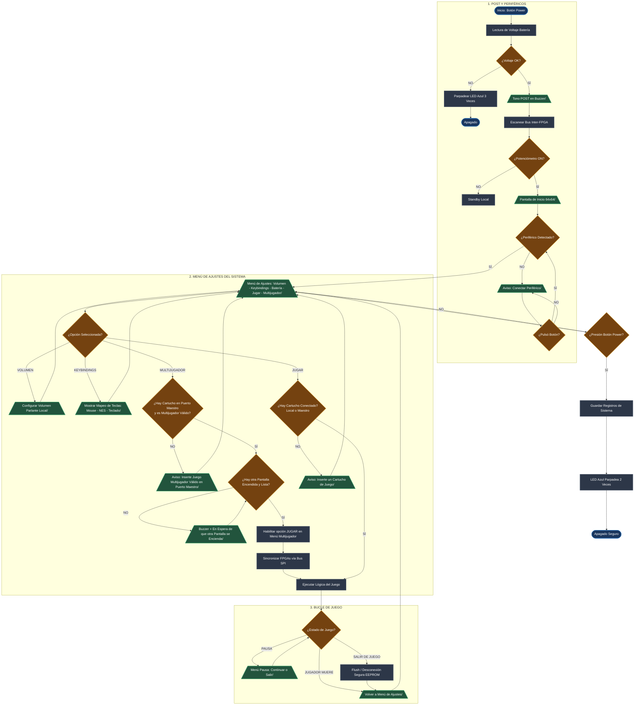

```mermaid
flowchart TD
    %% Estilos de Nodos
    classDef terminalStyle fill:#1a365d,stroke:#2b6cb0,stroke-width:2px,color:#fff;
    classDef processStyle fill:#2d3748,stroke:#4a5568,stroke-width:2px,color:#fff;
    classDef decisionStyle fill:#744210,stroke:#d69e2e,stroke-width:2px,color:#fff;
    classDef ioStyle fill:#22543d,stroke:#38a169,stroke-width:2px,color:#fff;

    %% FASE 1: POST Y PERIFÉRICOS
    subgraph F1["1. POST Y PERIFÉRICOS"]
        START([Inicio: Botón Power]):::terminalStyle --> READ_BAT[Lectura de Voltaje Batería]:::processStyle
        READ_BAT --> DEC_BAT{¿Voltaje OK?}:::decisionStyle
        
        DEC_BAT -- NO --> ERR_BAT[Parpadear LED Azul 3 Veces]:::processStyle --> OFF1([Apagado]):::terminalStyle
        DEC_BAT -- SÍ --> BEEP_POST[/Tono POST en Buzzer/\]:::ioStyle --> SCAN_BUS[Escanear Bus Inter-FPGA]:::processStyle
        
        SCAN_BUS --> POLL_POT{¿Potenciómetro ON?}:::decisionStyle
        POLL_POT -- NO --> STANDBY[Standby Local]:::processStyle
        POLL_POT -- SÍ --> BOOT_SCR[/Pantalla de Inicio 64x64/\]:::ioStyle --> CHECK_PERIPH{¿Periférico Detectado?}:::decisionStyle
        
        CHECK_PERIPH -- NO --> WARN_P[/Aviso: Conectar Periférico/\]:::ioStyle
        WARN_P --> WAIT_P{¿Pulsó Botón?}:::decisionStyle
        WAIT_P -- SÍ --> CHECK_PERIPH
        WAIT_P -- NO --> WARN_P
    end

    CHECK_PERIPH -- SÍ --> BIOS_MENU

    %% FASE 2: MENÚ DE AJUSTES DEL SISTEMA (BIOS / INICIO)
    subgraph F2["2. MENÚ DE AJUSTES DEL SISTEMA"]
        BIOS_MENU[/Menú de Ajustes: Volumen - Keybindings - Batería - Jugar - Multijugador/\]:::ioStyle
        
        BIOS_MENU --> DEC_BIOS{¿Opción Seleccionada?}:::decisionStyle
        
        %% Ajustes secundarios
        DEC_BIOS -- VOLUMEN --> CONF_VOL[/Configurar Volumen Parlante Local/\]:::ioStyle --> BIOS_MENU
        DEC_BIOS -- KEYBINDINGS --> SHOW_KEYS[/Mostrar Mapeo de Teclas: Mouse - NES - Teclado/\]:::ioStyle --> BIOS_MENU
        
        %% Opcion MULTIJUGADOR (Requiere validación de juego + espera de otra pantalla)
        DEC_BIOS -- MULTIJUGADOR --> CHK_M_CART{¿Hay Cartucho en Puerto Maestro<br/>y es Multijugador Válido?}:::decisionStyle
        CHK_M_CART -- NO --> WARN_NO_MULTI[/Aviso: Inserte Juego Multijugador Válido en Puerto Maestro/\]:::ioStyle --> BIOS_MENU
        CHK_M_CART -- SÍ --> WAIT_SLAVES{¿Hay otra Pantalla Encendida y Lista?}:::decisionStyle
        WAIT_SLAVES -- NO --> WARN_WAIT_SCR[/Buzzer + En Espera de que otra Pantalla se Encienda/\]:::ioStyle --> WAIT_SLAVES
        WAIT_SLAVES -- SÍ --> EN_PLAY_MULTI[Habilitar opción JUGAR en Menú Multijugador]:::processStyle --> SYNC_MULTI[Sincronizar FPGAs vía Bus SPI]:::processStyle --> RUN_GAME
        
        %% Opción JUGAR (Modo Individual / Espejo Directo)
        DEC_BIOS -- JUGAR --> CHK_ANY_CART{¿Hay Cartucho Conectado?<br/>Local o Maestro}:::decisionStyle
        CHK_ANY_CART -- NO --> WARN_NO_CART[/Aviso: Inserte un Cartucho de Juego/\]:::ioStyle --> BIOS_MENU
        
        %% Ejecución Inmediata
        CHK_ANY_CART -- SÍ --> RUN_GAME[Ejecutar Lógica del Juego]:::processStyle
    end

    %% FASE 3: BUCLE DE JUEGO Y SALIDA
    subgraph F3["3. BUCLE DE JUEGO"]
        RUN_GAME --> GAME_STATE{¿Estado de Juego?}:::decisionStyle
        
        GAME_STATE -- PAUSA --> MENU_PAUSE[/Menú Pausa: Continuar o Salir/\]:::ioStyle --> GAME_STATE
        GAME_STATE -- JUGADOR MUERE --> RET_BIOS[/Volver a Menú de Ajustes/\]:::ioStyle
        GAME_STATE -- SALIR DE JUEGO --> SAFE_UNMOUNT[Flush / Desconexión Segura EEPROM]:::processStyle --> RET_BIOS
    end

    RET_BIOS --> BIOS_MENU

    %% FASE 4: APAGADO
    BIOS_MENU --> EVENT_OFF{¿Presión Botón Power?}:::decisionStyle
    EVENT_OFF -- NO --> BIOS_MENU
    EVENT_OFF -- SÍ --> SAVE_SYS[Guardar Registros de Sistema]:::processStyle --> LED_OFF[LED Azul Parpadea 2 Veces]:::processStyle --> SHUTDOWN([Apagado Seguro]):::terminalStyle
```
