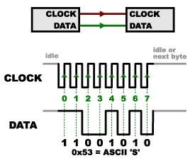
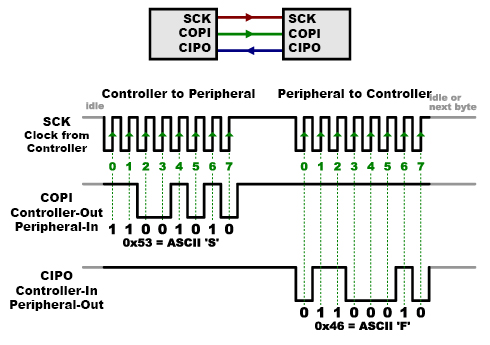
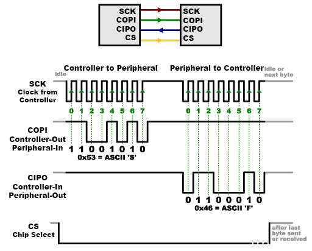
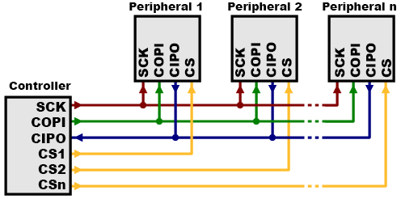
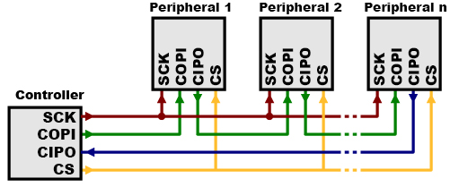

# Protocolo SPI (SERIAL PERIPHERAL INTERFACE)

Éste es el protocolo de memoria designado para el funcionamiento de la memoria RAM. Es necesario conocer cómo funciona antes de implementarlo al sistema y para esa finalidad se mencionan aquí las características más importantes. 

El nombre del protocolo, por sus siglas en inglés, significa interfaz de periféricos en serie. Es un bus de interfaz usado comunmente para la comunicación entre microcontroladores y periféricos que trabaja con línea de reloj, datos y selección separadas.
Aunque el protocolo es serial, no consiste en el serial convensional con TX y RX asíncrono sin control sobre las líneas de datos; no se sabe cuándo se envían los datos ni se asegura que estén sincronizados con un único reloj (obligatorio en equipos de computación). Para corregir los problemas producto de la asincronía en el protocolo convencional, se crearon algunos métodos para permitir la lectura correcta de los datos como: 

* Establecer una velocidad de transmisión previa al envío de un byte.
* La aparición de bits de inicio y parada en cada que permitían al receptor corregir las pequeñas diferencias en la velocidad de transmisión.\

Aunque el protocolo serial convencional funcionaba, se generaba mucha carga por la presencia de los bits adicionales y podían producirse errores.

## La solución seríal síncrona (SPI)
Para corregir los problemas en la diferencia del reloj del protocolo serial convencional se creó el protocolo SPI. El SPI consistía en un bus de datos síncrono, lo que implicaba su sincronía total con el receptor y con ello la presencia de líneas separadas de datos y reloj. La línea del reloj es una señal oscilante que le indica al receptor cúando muestrear los bits de las líneas de datos; pudiendo ser durante el flanco ascendente (subiendo) o descendente (bajando) -se especifica cuál de los dos usar en una hoja de datos-. En el instante en el que el receptor detecte ese flanco, pasa a la lectura del siguiente bit y puesto que se envía un línea de reloj no es necesario especificar la velocidad lo que facilita que el dispositivo/hardware sea más sencillo que en el caso asíncrono (y de menor precio).

Aunque esto soluciona la parte correspondiente al envío de información, aún falta definir como se recibe la información.

### Líneas CIPO/COPI

En SPI la señal del reloj (CLK o SCK) es enviada desde un único lado denominado controlador (microcontrolador spiram_ctrl.v) y el lado que la recibe se denomina periférico (chip de memoria); aunque pueden haber muchos periféricos, sólo hay un controlador. Cuando los datos se envían hacia el periférico desde el controlador se hace por una línea denominada COPI (controller out-peripheral in) y cuando se envían del periférico al controlador se denominan CIPO (controller in-peripheral out). En este caso pueden haber dos líneas de datos, de forma que cuando el controlador envía información al periférico lo hace mediante la línea de COPI y si el periférico necesita enviar una respuesta lo hará mediante otra línea llamada CIPO conservando la sincronización con los ciclos de reloj del controlador (no desaparecen).

Puesto que existe una velocidad de reloj preestablecida en SPI eso permite al controlador saber cuándo y cuántos datos se van a recibir de un periférico. A propósito de las dos líneas de datos, según sea el caso del periférico se podrán estar leyendo y escribiendo datos en simultáneo.

### Línea CS

Otra línea presente en el protocolo SPI habla del tipo de chip, denominada *CHIP SELECT*. Como su nombre lo indica permite seleccionar un periférico específico para darle la orden de recibir/enviar datos. Esta línea suele permanecer alta para desconectar el periférico del bus. Ates del envío de los datos (COPI o CIPO) se baja la señal para habilitar el periférico y vuelve a subir después de que termina. 

### Conexión múltiple periféricos SPI

Existen dos formas de conexión múltiple de periféricos SPI: 

1. Líneas CS independientes:
Los periféricos conectados comparten las líneas de transmisión de datos y de reloj y sólo tienen la línea CS independiente. Puesto que ls línea CS trabaja con una lógica activa baja, sólo es necesario mantener las señales de los periféricos altas y bajar exclusivamente la del periférico deseado cuando se requiera el tráfico de datos. Ya que con este método se requieren muchas líneas CS, se requiere verificar múltiples salidas o el uso de algún multiplicador (chip secundario).

2. Conexión en cadena:
En este caso las líneas de entrada y salida se interconectan entre los periféricos hasta el controlador (CIPO periférico 1 a COPI periférico 2, etc). Sólo se requiere una línea CS y para enviar algún dato se deben despertar todos los periféricos y cuando se desea enviar un dato a alguno particular, se deben enviar suficientes datos como para que alcancen para todos ya que la información se envía como si fuera una cola; el primer dato enviado llega al primer periférico y así según el orden de conexión. Por su estructura suele usarse sólo en sistemas de transmisión exclusiva de datos.

